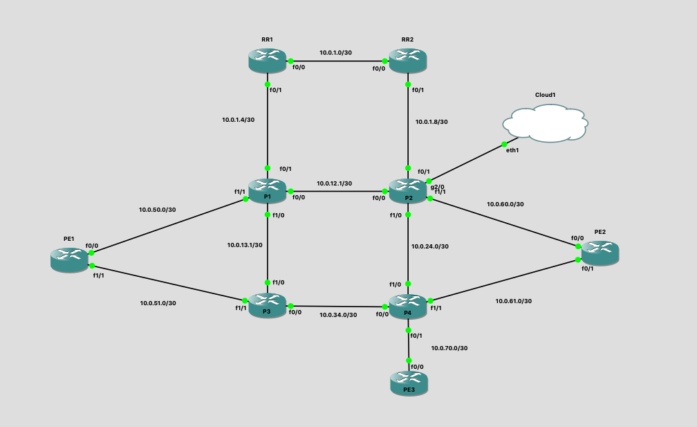

# Ansible L3VPN Deployment playbook

This repo contains two playbooks that I've used to deploy and remove MPLS L3VPN services between PE nodes in the GNS3 topology below.

## Variables structure

The `group_vars/all.yml` file is where the BGP AS is defined as well as the VRFs and their associated route targets.

Each `host_vars` file contains four sections:
- vrfs
- interfaces
- add
- remove

The vrfs section is defined as a dictionary with key value pairs, with the name of the vrf as the key and the route designator as the value. 

The interfaces section is defined as a dictionary of dictionaries with the second layer key in the dict being the actual interface name. Each interface dict contains the variables description, vlan(needed if it's a subinterface), vrf, ipAddress, networkMask.

The two sections above were defined in a way to provide a sense of state for the L3VPN configurations on a specific router. The vrfs and interfaces need to be defined before the services can be added as they are directly referenced in the templates. Once a vrf or interface is set to be removed, their items can be removed from the vrf and interfaces sections as they will no longer be present on the router.

The add section is a list of dictionaries and contains 3 keys.
- Service: this defines the type of service you'd like to add. Options include `all`, which will build the vrf, interface, and bgp configurations, and `interface` which will build only the interface configruation as it is implied that the associated vrf is already created.
- Name: The vrf name as a string. References the vrfs dict to pull the vrfs route target to the template
- Interface: A list of interfaces as strings. References the interfaces dict and pulls the necessary variables to the template.

The remove section is defined similar to the add section with the exception that the remove section does not directly reference any values in the vrfs or interfaces dicts.

## Playbook structure

Both playbooks, `provision_l3vpn_services.yaml` and `remove_l3vpn_services.yaml` contain tasks to either generate local config files without pushing to the devices, pushing the generated configs to the devices, as well as doing both tasks together.